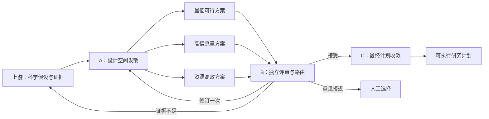

# Planning Agent 产品理念与 A/B/C 工作流讲解

## 1. 一句话讲清楚这个产品

Planning Agent 不是让大模型一次性“写一份看起来完整的研究计划”，而是把从科学假设到可执行计划的过程，拆成一个**先产生备选方案、再公开评审取舍、最后生成正式计划**的可控决策流程。

```text
A：同一个假设，可以怎样验证？
B：这些验证方案中，哪一个最值得执行？为什么？
C：把选中的方案变成一份真正可执行、可检查、可迭代的研究计划。
```

我们卖的不是“又一个会写长文的 AI”，而是一个让研究规划过程**看得见、选得了、改得动、追得回**的 Planning Agent。

## 2. 为什么要重新设计原来的单 Workflow

### 2.1 用户真正缺的不是一篇计划书，而是一个可靠的决策过程

上游 Agent 已经完成了问题理解、文献检索、证据整理和科学假设生成。Planning Agent 接手时，用户已经知道“可能要验证什么”，但还不知道：

- 应该采用什么研究设计；
- 在有限时间、数据和算力下先做什么；
- 哪些变量、基线、指标和统计方法必须保留；
- 什么结果支持假设，什么结果会推翻假设；
- 证据不足时，是继续规划、请求补证据，还是交给人判断。

这不是单纯的文本生成任务，而是一个包含方案搜索、约束权衡、质量判断和执行展开的决策任务。

### 2.2 原来“一次调用直接出最终计划”的问题

原始 C-only 方式可以生成计划，但产品体验有五个明显问题：

1. **只有一个答案。** 用户不知道是否存在更便宜、更稳妥或信息量更高的方案。
2. **取舍过程不可见。** 最终计划为什么选择某个方法、放弃另一个方法，只藏在模型内部。
3. **难以介入。** 用户只能接受或推翻整份计划，不能在“选方案”这个关键节点做决定。
4. **失败定位困难。** 计划不好时，无法判断是设计空间不足、选择错误，还是最终展开错误。
5. **等待感很强。** 一个长 Workflow 连续做证据摘要、骨架、生成和修复，前端长时间只能显示加载中。

因此，我们没有继续把所有能力塞进一个更大的 Prompt，而是把研究规划拆成三个职责明确的产品模块。

## 3. 核心设计理念：发散、决策、收敛



| 阶段 | 产品角色 | 核心问题 | 主要价值 |
|---|---|---|---|
| A | 方案设计师 | 同一个假设有哪些合理验证路径？ | 扩大设计空间，避免第一答案偏见 |
| B | 独立评审者 | 哪个方案在当前证据和约束下最好？ | 显式比较、解释取舍、控制路由 |
| C | 计划编译器 | 如何把选中方案变成正式计划？ | 快速收敛，保证完整性和交付格式 |

这三个阶段不是三个模型重复回答同一个问题，而是把一个复杂决策拆成三个不同性质的任务：

```text
A 负责“有哪些选择”
B 负责“为什么选它”
C 负责“选定以后怎样执行”
```

## 4. 上游假设与 Workflow A 为什么不重复

这是最容易被问到的问题。

### 4.1 上游假设回答“验证什么”

上游假设生成 Agent 输出的是一个科学命题，通常已经包含：

- 假设陈述；
- 提出假设的理由；
- 目标变量；
- 假设成立时的预期观察；
- 一句粗粒度的验证思路。

例如：

> 基于生成模型不确定性的自适应检索门控，可以在基本保持事实准确率的同时，降低平均检索次数和上下文 token 消耗。

这已经是一个明确假设，但它还不是一套可以直接执行的实验方案。

### 4.2 A 回答“怎样验证同一个命题”

A 不产生新假设，也不把一个假设拆成三个子假设。它保留相同的 `hypothesis_id` 和科学含义，只把粗粒度 `validation_idea` 展开成三种不同取向的验证设计。

```text
一个 hypothesis
├── minimum_viable：最快得到第一轮信号
├── high_information：最大化结论信息量
└── resource_efficient：在预算约束下提高效率
```

如果上游假设本身过于宽泛，A 也不应该擅自改写它。A 应输出限制和反馈任务，由 B 决定修订、补证据或人工审核。

因此两者的边界是：

```text
上游定义科学命题；A 负责实验操作化。
```

## 5. Workflow A：为什么需要三个设计候选

### 5.1 A 的产品目标

A 的目标不是“多生成几次增加热闹”，而是主动覆盖研究设计中最常见的三个价值取向，让用户看到真实存在的取舍。

| 模式 | 优先目标 | 典型做法 | 适合场景 |
|---|---|---|---|
| `minimum_viable` | 最快验证方向是否成立 | 小样本、关键基线、少量核心指标 | 比赛演示、早期探索、快速排雷 |
| `high_information` | 最大化结论强度和解释力 | 更多数据分层、消融、稳健性与异质性分析 | 论文方案、关键决策、证据要求高 |
| `resource_efficient` | 在预算约束下获得足够结论 | 顺序检验、早停、复用公开数据、缩减组合 | 算力、时间、数据获取受限 |

三个模式代表设计空间中的三个典型角点：**速度、信息量、资源效率**。它们不是随机抽样，也不是简单换一种措辞。

### 5.2 A 具体产出什么

每个候选都要把假设转成一套实验蓝图，包括：

- 研究目标和设计类型；
- 自变量、因变量、控制变量及操作化方式；
- 数据需求和数据约束；
- 实验步骤、基线和对照；
- 评价指标与统计分析；
- 支持、削弱或推翻假设的判据；
- 失败时的备选方案；
- 时间、算力和资源画像；
- 证据缺口和反馈任务。

### 5.3 A 带来的产品价值

- **避免第一答案偏见：** 不把模型第一次想到的方案直接当成最终方案。
- **让取舍可见：** 用户看到的不只是三段文字，而是三个有明确目标的选择。
- **支持并行反馈：** 三个候选可以分别加载和完成，用户能持续看到进展。
- **提高容错性：** 一个候选失败时，其他候选仍可进入 B，形成 `partial_success`，而不是整条链路报废。
- **为人工介入创造位置：** 用户可以在“选择设计”阶段介入，而不用改整份最终计划。

## 6. Workflow B：为什么一定要有独立评审

### 6.1 B 解决“自己出题、自己判卷”的问题

如果让 A 生成三个候选后直接自己选，模型很容易偏爱最像自己当前生成习惯的方案。B 被设计成独立 Judge/Selector，只能评估已有候选，不能产生新假设、补造证据或偷偷改写候选目标。

B 的存在让“选择”从隐藏模型行为变成一个可以展示、复核和追责的产品对象。

### 6.2 B 先看硬门槛，再看软评分

B 不是简单比较哪段文字更漂亮，而是检查：

1. 是否忠于原始假设；
2. 证据和文献引用是否可追溯；
3. 方法与统计分析是否合理；
4. 数据是否可获得、设计是否可执行；
5. 是否真正可证伪；
6. 资源和风险是否与当前约束匹配；
7. 是否方便后续迭代和修订。

对应的七个正式评分维度是：

```text
hypothesis_alignment
evidence_traceability
method_and_statistics
data_feasibility
falsifiability
resource_and_risk
iteration_readiness
```

### 6.3 B 不一定强行选一个

B 可以输出五种决策：

| 决策 | 含义 | 产品行为 |
|---|---|---|
| `accept` | 有明确优胜者且硬门槛通过 | 将选中设计交给 C |
| `revise_once` | 方向可用，但候选存在可修复问题 | 按明确意见让 A 有界重做一次 |
| `human_review` | 候选接近、分歧或风险需要人决定 | 暂停并让用户选择 |
| `feedback_required` | 当前证据不足以支持可靠规划 | 向上游请求补证据 |
| `failed` | 输出或引用不合法，无法继续 | 停止并报告原因 |

这个路由机制很重要：一个可靠的 Agent 不应该在不确定时永远假装有答案。

### 6.4 B 带来的产品价值

- 把“为什么选这个方案”变成结构化、可展示的解释；
- 允许人工审核发生在最有价值的决策节点；
- 将证据不足与方案不好区分开；
- 用有界重试防止 Agent 无限循环；
- 为后续评估积累可量化数据，例如各候选得分、接受率和人工介入率。

## 7. Workflow C：为什么有了 A/B 还需要 C

A 给出的是实验蓝图，B 给出的是评审和选择；它们还不是面向最终用户和下游系统的完整研究计划。

C 的职责是把 B 已接受的 `selected_design` 变成正式交付物，补齐：

- 问题陈述和证据逻辑链；
- 技术细节、数据集和方法；
- 实验步骤、基线、指标和统计方案；
- 预期结果与证伪标准；
- 文献引用、限制和反馈任务；
- 下游系统要求的稳定结构和身份字段。

### 7.1 C 的角色已经从“重新思考”变成“快速收敛”

旧 C 内部连续调用多个大模型，分别做证据摘要、计划骨架、完整生成和批判修复。这在没有 A/B 时有一定意义，但加入 A/B 后会重复做设计判断，导致耗时长、上下文反复压缩，甚至可能把 B 已经选好的方案重新改掉。

现在的 C 被重新定义为快速计划编译器：

```text
证据和约束归一化
-> 读取 B 的 selected_design
-> 一次生成完整计划
-> 确定性契约与引用检查
```

C 从四个串行 LLM 节点缩减为一个，并关闭 thinking。它不再重新发散，只负责把已决策的方案高质量落地。

### 7.2 C 带来的产品价值

- **缩短关键路径：** 不再重复执行证据摘要、骨架和 LLM critic。
- **保持决策一致：** 最终计划必须沿用 B 选中的方案。
- **稳定交付：** 最终输出符合统一 schema，可以直接进入总控和前端。
- **阻止引用幻觉：** 最终 Code 节点用 allowlist 检查 evidence/source ID，不依赖模型自觉。
- **保留兼容性：** 没有 A/B 信息时仍可走 C-only 路径，方便灰度接入。

## 8. 一个完整例子：自适应检索门控假设怎样经过 A/B/C

### 8.1 上游给出的假设

> 基于生成模型不确定性的自适应检索门控，可以在基本保持事实准确率的同时，降低平均检索调用次数和上下文 token 消耗。

上游已经说明了命题、依据、目标变量和预期观察，但只给出“比较固定检索、从不检索和多档阈值”的方向性验证思路。

### 8.2 A 生成三种验证设计

| 候选 | 设计思路 |
|---|---|
| 最低可行 | 选择少量公开问答数据，比较固定检索、从不检索和三档门控阈值，快速验证质量是否明显下降、成本是否明显降低 |
| 高信息量 | 增加不同问题类型、更多阈值、置信度校准和消融实验，绘制完整质量—成本 Pareto 边界 |
| 资源高效 | 使用小样本顺序检验和早停；当某阈值明显劣于基线时提前终止，减少推理调用 |

三个候选验证的是同一个假设，只是实验规模、信息量和资源策略不同。

### 8.3 B 公开比较并选择

假设当前比赛约束是“演示级资源、需要快速得到可信结果”。B 可能得出：

- 高信息量方案结论最全面，但样本和消融组合过多；
- 资源高效方案成本最低，但顺序检验设计对演示解释稍复杂；
- 最低可行方案保留核心基线、指标和显著性比较，同时最适合当前周期。

因此 B 选择最低可行方案，并明确记录：选择理由、其他方案的优点、当前限制和下一轮可扩展方向。

这只是产品案例，实际选择由输入证据和约束决定，不是固定选择某一种模式。

### 8.4 C 生成正式计划

C 不再重新决定要做哪种实验，而是把选中方案展开成：

- 数据集选择和纳入条件；
- 不确定性分数与门控阈值定义；
- 固定检索、从不检索和自适应检索基线；
- 事实准确率、检索次数、延迟和 token 消耗指标；
- 配对检验或非劣效分析；
- 哪种结果支持、削弱或推翻假设；
- 证据不足时需要补充的反馈任务。

最终用户看到的不只是“AI 给了一份计划”，而是“AI 展示了三个选择、解释了为什么选这个，并把它落实成了计划”。

## 9. 从用户视角看，产品应该怎样呈现

```text
假设卡片
  ├─ A：三个候选方案分别加载、分别完成
  ├─ B：候选对比、评分、优缺点和选择理由
  ├─ 可选：用户人工确认或切换方案
  └─ C：基于选中方案生成正式研究计划
```

用户应该看到的是结构化决策产物，而不是模型的隐藏思考过程：

- A 阶段看到三个有明确标签的方案卡；
- B 阶段看到对比结论和决策理由；
- C 阶段看到正式研究计划；
- 发生问题时看到“候选失败、需要补证据、需要人工选择”等业务状态。

这会把漫长的等待变成一个可理解的推进过程，也让比赛演示能够证明 Agent 确实在规划，而不是只生成了一段长文本。

## 10. 为什么不把 A/B/C 合回一个大 Workflow

| 对比项 | 单次直接生成 | A/B/C 产品流程 |
|---|---|---|
| 设计空间 | 只有一个方案 | 三种明确取向的候选 |
| 决策解释 | 隐藏在模型中 | B 输出评分、优缺点和选择理由 |
| 人工介入 | 只能修改整份计划 | 可在候选选择节点介入 |
| 失败定位 | 很难判断哪里错 | 可区分 A、B、C 和证据问题 |
| 前端展示 | 长时间加载后出现结果 | 分假设、分候选、分阶段展示 |
| 迭代方式 | 重新生成整份计划 | 有界修订候选或补充证据 |
| 最终一致性 | 模型可能反复改变方案 | C 沿用 B 的 selected design |

### 10.1 关于性能要诚实说明

A/B/C 不等于“模型调用次数一定更少”。一个 hypothesis 在成功路径上通常包含三次并行 A、一次 B 和一次 C。

我们优化的是：

- 三个 A 并行运行，关键路径不是三者时间相加；
- 每个模块上下文更聚焦、输出更短；
- C 从四个串行 LLM 缩减为一个；
- 前端可以持续显示中间产物，降低感知等待；
- 失败可以早停，不必每次生成完整长计划；
- 质量和可控性提升，减少整份计划推倒重来的成本。

因此，这套设计的核心收益是**可控性、可解释性和有效等待时间**。是否降低总 token 成本，需要在真实运行数据中继续测量，不能预先夸大。

## 11. 这套设计对参赛产品的价值

### 11.1 它把 Agent 能力变成可演示的产品能力

评委不需要相信“模型内部做了复杂推理”，因为页面可以直接展示：

- 同一假设的三套验证路径；
- 每套方案的资源与信息取舍；
- 独立评审的评分和选择理由；
- 人工审核或补证据的分支；
- 最终计划如何继承选中设计。

### 11.2 它体现了真正的 Agent，而不只是 Prompt

真正的 Agent 产品需要：

- 状态；
- 决策；
- 分支；
- 失败恢复；
- 人机协作；
- 可追踪的中间产物。

A/B/C 正好把这些能力放进研究规划场景，而不是为了复杂而复杂。

### 11.3 它为后续产品迭代留下接口

未来可以在不重写全部系统的情况下增加：

- 用户偏好某类设计的个性化选择；
- 不同领域的 B 评分 rubric；
- 人工选择后的 C 恢复；
- 历史候选和最终效果之间的离线评估；
- 根据真实实验反馈重新进入 A/B 的下一轮规划。

## 12. 产品边界：我们明确不做什么

Planning Agent 不应该重复上游职责：

- 不重新提出科学假设；
- 不擅自搜索或编造新文献；
- 不新增输入中不存在的 evidence/source ID；
- 不声称真实实验已经完成；
- 不在证据不足时强行输出确定结论。

它专注于把已有假设和证据转化成**可执行、可证伪、可迭代**的研究计划。

## 13. 建议关注的产品指标

| 指标 | 说明 |
|---|---|
| A 候选可用率 | 三个候选中通过 guardrail 的比例 |
| A 多样性 | 三个候选在方法、资源和信息量上的差异是否真实 |
| B 接受率 | 首轮能够明确选出方案的比例 |
| 修订/人工审核率 | 系统在哪些场景无法自动决策 |
| C 契约通过率 | 最终计划结构和引用检查通过比例 |
| 分阶段耗时 | A、B、C 各自耗时和整体关键路径 |
| 证据幻觉拦截数 | 被 allowlist 阻止的未知引用数量 |
| 用户改选率 | 用户是否经常推翻 B 的选择，以及原因 |

这些指标能帮助我们判断系统是真的提升了规划质量，还是只增加了流程复杂度。

## 14. 会议上可以直接使用的 30 秒版本

> 我们原来的 Planning Agent 是一次性生成最终计划，虽然能运行，但过程很黑盒，用户看不到还有什么选择，也不知道为什么选当前方案。现在我们把它拆成 A、B、C：A 针对同一个上游假设，并行生成最低可行、高信息量和资源高效三种验证设计；B 作为独立评审，比较证据、方法、可执行性、证伪性和资源风险，决定接受、修订、补证据还是交给人；C 不再重新思考方案，只把 B 选中的设计快速扩展成正式研究计划。这样产品从“AI 写计划”升级成“AI 展示选择、解释决策并交付计划”。

## 15. 会议上可以直接使用的 3 分钟讲稿

### 第一段：先讲问题

> 上游已经给了我们科学假设和证据，所以 Planning Agent 的任务不是再想一个假设，而是决定怎样验证它。原来的做法是把所有上下文交给一个大 Workflow，等几分钟后拿到一份长计划。这个方式的问题是只有一个答案、选择过程看不见、用户很难介入，而且失败后也不知道是哪一步出了问题。

### 第二段：讲设计原则

> 所以我们采用“先发散、再决策、后收敛”的思路。A 负责发散设计空间，B 负责显式评审和路由，C 负责收敛成最终交付。三个模块不是重复做同一件事，而是分别回答“有哪些方案”“为什么选它”“选定后怎样执行”。

### 第三段：讲 A

> A 不拆新假设。它对同一个 hypothesis 并行给出三种验证路径：最低可行方案追求快速得到信号，高信息量方案追求更强结论，资源高效方案追求在预算限制下完成验证。这样用户第一次看到的不是唯一答案，而是明确的研究取舍。

### 第四段：讲 B

> B 是独立评审，它先检查是否忠于假设、引用是否可追溯、方法和数据是否可行、是否可证伪，再比较资源风险和迭代价值。它不一定强行选一个，也可以要求修订一次、请求补证据或交给用户。这样“为什么选这个方案”成为可展示、可审核的数据。

### 第五段：讲 C 和价值

> C 只做最后收敛，把 B 选中的设计扩展成完整研究计划。因为 A/B 已经完成设计和判断，我们把 C 从四个串行大模型节点缩减成一个，避免重复推理。最终前端可以按假设展示三个候选的加载过程、B 的对比和选择、C 的正式结果。我们的核心差异不是生成更长的计划，而是让研究规划过程可控、可解释、可人工介入。

## 16. 常见质疑与回答

### Q1：上游已经有 `validation_idea`，A 是否重复？

不重复。`validation_idea` 是一句方向性建议；A 需要补齐变量操作化、数据、基线、步骤、指标、统计、证伪和资源计划。前者是“可以这样试”，后者是“这套实验怎样执行”。

### Q2：为什么是三个候选，不是两个或五个？

三个候选对应速度、信息量和资源效率三个最常见取向，能够在产品复杂度和选择价值之间取得平衡。两个往往覆盖不足，五个会增加成本和用户认知负担。未来可以配置，但比赛版本保持三个稳定槽位更容易理解和展示。

### Q3：为什么不能让 A 自己选？

生成和评审目标不同。独立 B 可以使用统一 rubric 比较所有候选，减少生成者偏好，也能在不确定时走人工审核或补证据，而不是强行合理化自己的答案。

### Q4：多了 A 和 B，会不会更慢？

总调用数可能增加，但三个 A 并行运行；C 已从四个串行 LLM 缩减为一个。更重要的是，用户能看到中间结果，失败可以早停，整份计划不需要反复推倒重来。我们会用分阶段耗时和 token 数据继续验证，而不是只凭感觉声称更快。

### Q5：B 选错了怎么办？

B 会保留每个候选的评分、优缺点和选择理由；接近或高风险时进入 `human_review`。后续前端可以允许用户改选 candidate，再让 C 基于人工选择继续。

### Q6：有了 selected design，C 还有什么智能价值？

候选设计仍是一张实验蓝图。C 负责把它与完整证据上下文结合，生成正式的数据、方法、实验、统计、证伪、文献和反馈结构，并满足下游契约。C 的价值是可靠展开，而不是重新做选择。

### Q7：这是不是为了显得复杂而拆流程？

如果拆分后没有独立产物、分支和干预点，就只是形式复杂。当前 A 有三套可比较方案，B 有明确评分和五种路由，C 继承 selected design 并输出正式计划，每一层都解决不同产品问题，也都可以独立观测和测试，因此不是为了节点数量而拆分。
